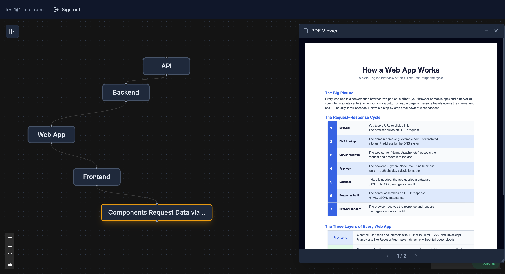
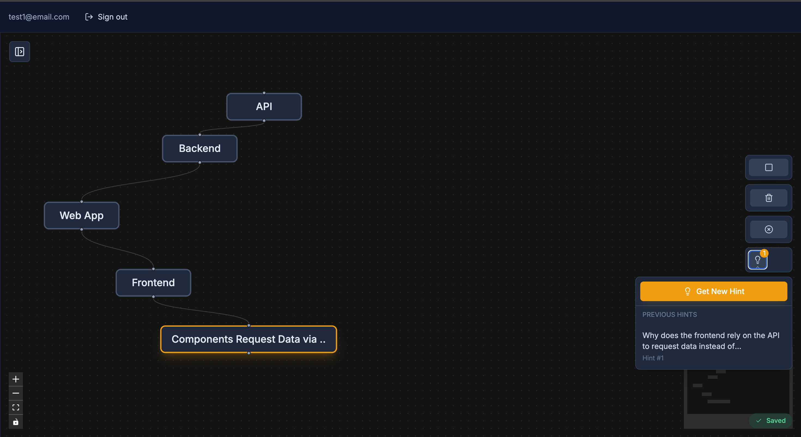
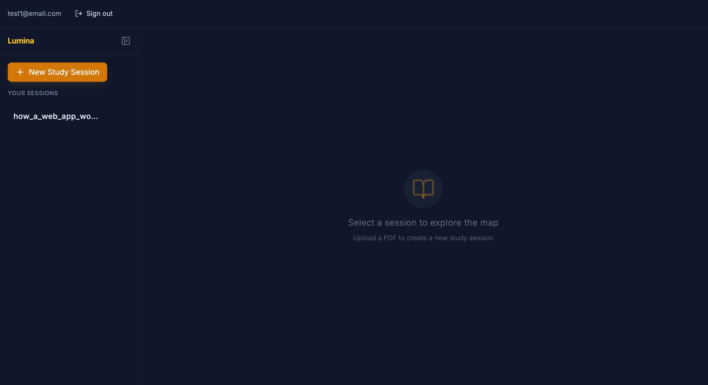
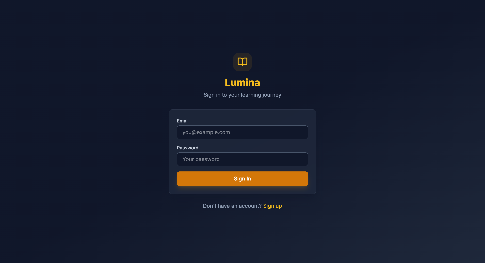

# Lumina

### AI-Powered Socratic Learning

**Proof of Concept** &nbsp;|&nbsp; [LinkedIn](linkedin.com/in/muhammad-azeem-worsdorfer)

---

## About

Lumina is a proof-of-concept exploring how AI can transform passive reading into active, relational thinking. It uses Socratic questioning and interactive mind mapping to help students identify knowledge gaps in real-time. A full-featured version is planned for commercial release.

This project demonstrates full-stack development skills, AI/ML integration, and building products with real-world educational impact.

## Problem & Solution

**Problem:** Students often read passively—highlighting text without truly understanding or retaining concepts.

**Solution:** Lumina tracks your mental model through an interactive mind map, identifies gaps in your knowledge, and guides you with Socratic questions to deepen comprehension—turning passive reading into active learning.

## Features

- **PDF Upload** — Ingest textbooks and papers with semantic chunking
- **Mind Map Editor** — Interactive concept mapping with ReactFlow
- **Socratic Hints** — AI-powered questions to guide learning when stuck
- **Gap Analysis** — Identifies missed relationships and misconceptions

## Screenshots

### Main Application


### Mind Map with AI Socratic Guidance


### Dashboard


### Authentication


## Technical Highlights

- **RAG Pipeline** — Vector similarity search with pgvector for semantic retrieval
- **Local LLM** — Ollama integration for privacy-first, zero API-cost AI
- **Full-Stack Architecture** — React frontend + FastAPI backend
- **Real-Time Gap Detection** — Algorithm that surfaces knowledge blind spots

## Tech Stack

| Layer | Technology |
|-------|------------|
| Frontend | React 19 + Vite + ReactFlow |
| Backend | FastAPI (Python 3.13) |
| Database | Supabase (PostgreSQL + pgvector) |
| AI | Ollama (qwen3:8b) |

## Getting Started

### 1. Backend

```bash
cd backend
uv sync
uv run uvicorn app.main:app --reload
```

### 2. Frontend

```bash
cd frontend
npm install
npm run dev
```

### 3. Ollama

```bash
ollama pull qwen3:8b
```

## Project Structure

```
Lumina/
├── backend/                      # FastAPI API
│   ├── app/
│   │   ├── main.py               # FastAPI entry point
│   │   ├── api/v1/               # API routes
│   │   │   ├── deps/             # Dependencies (auth)
│   │   │   └── endpoints/       # Route handlers
│   │   ├── core/                 # Core utilities
│   │   ├── schemas/              # Pydantic models
│   │   └── services/             # Business logic
│   │       ├── ingestion/       # PDF processing
│   │       └── reasoning/        # AI/Socratic services
│   ├── Docs/                     # Architecture & database docs
│   ├── tests/                    # Unit & integration tests
│   └── uploads/                  # Temporary PDF storage
└── frontend/                     # React client
    └── src/
        ├── components/           # React components
        ├── pages/                # Page components
        ├── contexts/             # React contexts
        ├── services/             # API services
        ├── lib/                  # Libraries
        └── utils/                # Utilities
```

## Future Roadmap

- [ ] Timed Pomodoro Study Sessions
- [ ] End-of-Session Quizzes
- [ ] Enhanced Mind Mapping Capabilities
- [ ] Light Mode

## Contact

- [LinkedIn](linkedin.com/in/muhammad-azeem-worsdorfer)
